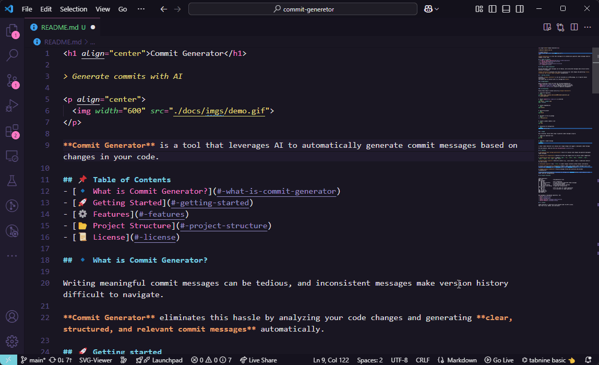

<h1 align="center">Commit Generator</h1>

> Generate commits with AI

<p align="center">
  
</p>

<p align="center">
  English
  | 
  <a href="./docs/readme/pt-BR/README.md">Português</a>
</p>

**Commit Generator** is a tool that leverages AI to automatically generate commit messages based on changes in your code.

## 📌 Table of Contents
- [🔹 What is Commit Generator?](#-what-is-commit-generator)
- [🚀 Getting Started](#-getting-started)
- [⚙️ Features](#️-features)
- [📂 Project Structure](#-project-structure)
- [📜 License](#-license)

## 🔹 What is Commit Generator?

Writing meaningful commit messages can be tedious, and inconsistent messages make version history difficult to navigate.  

**Commit Generator** eliminates this hassle by analyzing your code changes and generating **clear, structured, and relevant commit messages** automatically.  

## 🚀 Getting started

Currently, the primary way to interact with **Commit Generator** is through the **CLI**.

### 📋 Requirements

Before installing, ensure you have the following dependencies:
- [Node.js](https://nodejs.org/en) (Required for running the CLI) 
- [Git](https://git-scm.com/) (Used for repository management)  

### 🔧 Installation

Follow these steps to install and set up **Commit Generator**:

1. Install the package
```bash
npm install --global @commit-generator/cli
```

2. Initialize AI configuration
```bash
commitgen config init
```

### 🎯 Usage

Once installed, follow these steps to generate commit messages using AI.

1. Stage your modified files
```bash
git add .
```

2. Generate a commit message
```bash
commitgen
```

🎉 Done! Commit Generator will analyze your staged changes and suggest a meaningful commit message.

For more details, check out the [CLI documentation](./projects/cli).

## ⚙️ Features  

✅ **AI-powered commit message generation** – Uses AI to analyze code changes and generate meaningful commit messages.  

✅ **Seamless Git integration** – Analyzes Git diffs and staged files for precise commit suggestions.  

✅ **Standardized commit types** – Supports `feat`, `fix`, `chore`, `docs`, `refactor`, `test`, `style`, `build`, `ci`, `perf`, and `revert`.  

✅ **Context-aware commits** – Add extra context (e.g., issue numbers, scope, or additional details) for more clarity.  

✅ **Automated commits** – Use `--force` to commit changes instantly without manual confirmation.  

✅ **Commit editing & history management** – Modify, amend, and validate commit messages easily with commands like `commitgen edit`, `commitgen amend`, and `commitgen validate`.  

✅ **Commit message validation** – Ensures messages follow best practices and provides recommendations.  

✅ **Configurable AI provider** – Customize AI settings via `commitgen config`, with options to set, unset, and list configurations.  

## 📂 Project Structure

```
commit-generator/
│── docs/                   # Documentation files
│── packages/
│   ├── git/                # Git integration
│   ├── ai-models/          # Handles AI model interactions
│   ├── prompt-parser/      # Parses text templates into structured prompts
│   ├── commit-history/     # Tracks previously generated commit messages
│   ├── config/             # Configuration manager
│   ├── eslint-config/      # Pre-configured ESLint settings
│   ├── typescript-config/  # TypeScript configurations
│── projects
│   ├── core/               # The core logic for commit generation
│   ├── cli/                # CLI interface for commit generator
│── .gitignore
│── package.json
│── README.md
```

Each package is documented separately. See:
- [Core](./projects/core)
- [Cli](./projects/cli)
- [Git](./packages/git)
- [AI Models](./packages/ai-models/)
- [Prompt Parser](./packages/prompt-parser/)
- [Commit History](./packages/commit-history)
- [Config Manager](./packages/config)

## 📜 License

Commit Generator is open-source and released under the MIT License.
Feel free to use, modify, and contribute!