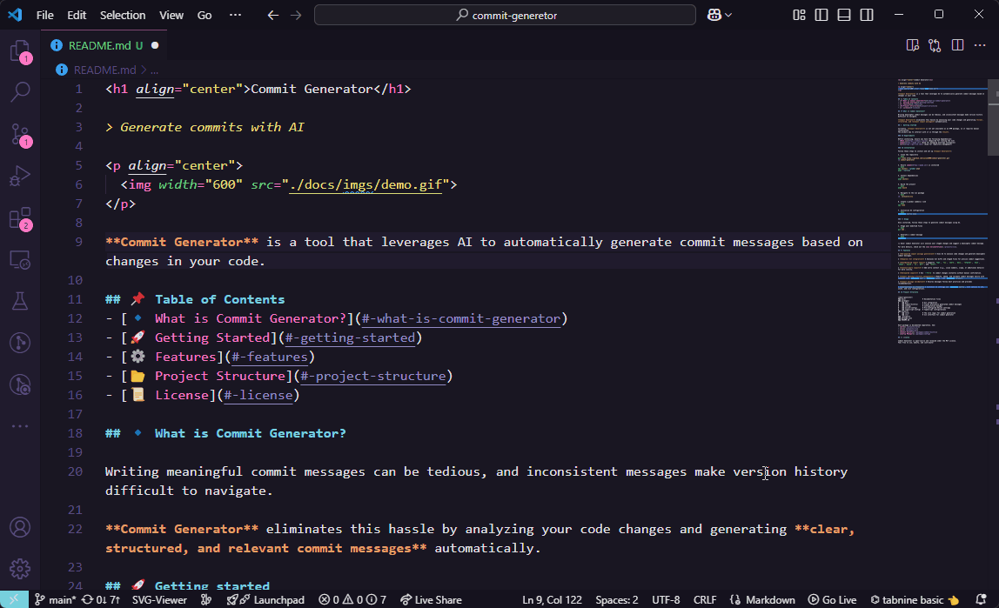

# @commit-generator/cli

<p align="center">
  
</p>

This package provides a CLI tool for generating commit messages based on Git diffs and AI models. It offers configurable commit message generation, editing, and validation.

## 📌 Table of Contents
- [Installation](#installation)
- [Usage](#usage)
    - [Default Workflow](#default-workflow)
    - [Manual Generation](#manual-generation)
    - [Validate a Commit Message](#validate-a-commit-message)
    - [Validate the Last Commit Message](#validate-the-last-commit-message)
    - [Persistent Configuration](#persistent-configuration)
    - [Dynamic Configuration](#dynamic-configuration)
- [Configuration Options](#configuration-options)
- [License](#-license)

## Installation

To use this package in your project, install it globally:

```bash
pnpm install -g @commit-generator/cli
```

To set up the configuration, run:

```bash
commitgen config init
```

This will launch an interactive prompt, allowing you to configure your AI model for commit message generation.

## Usage

Once installed, you can use the CLI with `commitgen <command>`.

### Default Workflow

To begin, stage your files:

```bash
git add .
```

Then run:

```bash
commitgen
```

This will open an interactive prompt, where you can provide additional context to improve message precision. After completion, the following options are available:
- Regenerate the commit message
- Edit the message (opens the default text editor)
- Commit the message
- Exit the prompt

### Manual generation

If you prefer to bypass the interactive prompt, use the following command to generate a commit message:

```bash
commitgen generate
```

This command will only generate the commit message without committing. You can then edit it with:

```bash
commitgen edit
```

Finally, to commit:

```bash
commitgen commit
```

### Validate a Commit Message

To validate a commit message, use the following command:

```bash
commitgen validate <message>
```

This compares the commit message with the staged diff and checks whether it adheres to best practices. If necessary, it will generate an improved commit message.

To commit the generated message, run:

```bash
commitgen commit
```

### Validate the Last Commit Message

To validate the most recent commit message, run:

```bash
commitgen validate
```

If needed, amend the commit message with:

```bash
commitgen amend
```

### Persistent Configuration

You can set the CLI configuration with:

```bash
commit config init
```

To set a configuration value:

```bash
commitgen config set <key>=value
# Example: commitgen config set provider=openai openai.key=some_key
# Example: commitgen config set exclude.files="pnpm-lock.yaml,package-lock.json"
```

To unset a configuration value:

```bash
commitgen config unset <key>
# Example: commitgen config unset exclude.files
```

To list the active configuration:

```bash
commitgen config list
```

### Dynamic Configuration

You can dynamically change the configuration using environment variables with the `commit_gen_config_` prefix. Replace `.` with `_`.

For example:

```bash
$env:commit_gen_config_openai_key = "some_key" # PowerShell
set commit_gen_config_openai_key=some_key # CMD
export commit_gen_config_openai_key="some_key" # Linux
```

You can also use `--<key>=<value>` for CLI options: 

```bash
commitgen config list --provider=ollama
```

## Configuration options

| Key             | Type            | Description                             |
|-----------------|-----------------|-----------------------------------------|
| `provider`      | `string`        | The AI provider to use                  |
| `openai.key`    | `string`        | The OpenAi authentication key           |
| `ollama.model`  | `string`        | The model to use in Ollama              |
| `exclude.files` | `Array<string>` | Files to exclude from the diff analysis |

## License

This package is licensed under the MIT License.